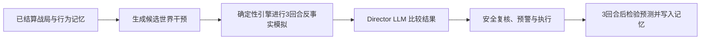

# CINDERFALL 双 AI 决策系统实施计划

## Implementation status — 2026-08-05

已实现：Python 同源服务、指定 Chat Completions 兼容接口、两个 Prompt 与
Schema、Saltkin 玩家画像/五局记忆/Doctrine 生命周期、Director 候选枚举与
三回合反事实模拟、40% 选择空间限制、shadow baseline、实时安全复核与多级
fallback、审计 UI、故障模拟、离线/服务测试及文档披露。

未使用对话中暴露的 Key，也未执行会产生费用的在线评估。请先撤销该 Key，
将新 Key 放入被忽略的 `.env`，再运行：

```powershell
python tools/online_eval.py --runs-per-scenario 4 --confirm-cost
```

## Summary

将项目升级为“双层产品”：

- 玩家获得会长期适应自己的 Saltkin，以及会主动调节战局的世界 Director。
- 设计师通过审计台观察两个目标不同、权限受限的 AI。

| AI | 核心目标 | 是否可以偏向一方 |
|---|---|---|
| Saltkin | 赢得比赛 | 可以，代表敌方 |
| Cinder Director | 提高冲突、选择多样性和戏剧张力 | 不可以，必须程序公平 |

核心原创性不是让 LLM 直接操作地图，而是构建：



## Saltkin Strategic AI

### 玩家画像

只从已经结算的公开历史计算以下特征：

- `beacon_chase`：目标距 Beacon 两格以内的订单占比。
- `high_ground_turtle`：在二级以上高地的 Fortify 消耗占比。
- `preferred_arc`：北线、南线或混合路线。
- `supply_neglect`：断补给格回合数占持有格回合数的比例。
- `warning_response`：灾害预警后主要选择撤离目标区域、加固或继续推进。
- `last_match_tactic`：上一局 Raid、Expand、Fortify 消耗占比最高的战术。

保存最近五局的聚合数据及上一局主要战术到版本化 `localStorage`，提供清除玩家记忆按钮，不保存身份或个人信息。

### Doctrine 生命周期

- 在回合开始、玩家尚未排队命令前冻结公开快照并请求 Doctrine。
- Doctrine 默认持续三个回合。
- 使用至少两个回合后，如发生世界事件、净失地达到三格或 Beacon 易主，可提前重新规划。
- 每回合最多请求一次；迟到响应必须校验 `matchId` 和 `snapshotTurn`。
- Saltkin 永远不能读取玩家本回合尚未提交的订单。
- Doctrine 尚未返回时继续使用上一份；三秒超时后使用现有启发式策略。

### Structured Output

```json
{
  "stance": "ASSAULT | GROWTH | FORTRESS",
  "objective": "BEACON | LAND | SUPPLY | CAPITAL",
  "target_region": "NORTH | SOUTH | EAST | WEST | CENTRE",
  "risk": "LOW | MEDIUM | HIGH",
  "player_model": ["beacon_chase", "preferred_arc"],
  "intent": "The Ashfarers keep overextending along the north arc, so we will pressure their supply line.",
  "evidence_used": ["north_order_share", "cut_off_tile_turns"]
}
```

现有确定性 Bot 将 Doctrine 映射为候选评分权重和区域偏好，再生成合法 Expand、Fortify、Raid：

- Doctrine 不能覆盖预算与命令合法性。
- Bot 仍拒绝无法成功的 Raid。
- Doctrine 不能指定具体方格。
- 无 LLM 时 `chooseMood()` 保持现有行为。

## Cinder Director

### 候选生成与模拟

每季基于已结算状态：

1. 枚举事件模板、强度和区域组合。
2. 使用现有 validator 剔除无效、破坏首都、过度伤害、切断环岛或连续针对同一方的候选。
3. 对相同地图结果去重，通过状态差异采样保留最多十个多样化候选，避免启发式规则预先替 Director 做决定。
4. 对每个候选运行三个回合的确定性反事实模拟：
   - 玩家继续当前画像战术；
   - 玩家响应预警并采取防御；
   - 玩家主动争夺新机会；
   - Saltkin 使用当前 Doctrine。
5. 输出每个候选的中位结果和范围：
   - raids、captures；
   - land gap、income gap；
   - Beacon 易手次数；
   - 双方断补给数量；
   - 双方可用 Expand/Raid 目标变化；
   - 公平性和玩家选择损失。

新增硬限制：任何一方可用 Expand/Raid 目标数下降超过 40% 的候选不得提交给 LLM。

### Director Output

```json
{
  "selected_candidate": "C1",
  "goal": "BREAK_STALEMATE",
  "evidence_used": ["quiet_turns", "high_ground_strength"],
  "prediction": {
    "metric": "raids_per_turn",
    "direction": "increase",
    "horizon": 3
  },
  "player_explanation": "Both armies have relied on high ground for four quiet turns, so Cinder removes its defensive bonus.",
  "confidence": 0.78
}
```

`goal` 限定为：

- `BREAK_STALEMATE`
- `RESTORE_COMPETITION`
- `CREATE_CONTESTED_PRIZE`
- `PRESERVE_VARIETY`
- `SLOW_RUNAWAY`

其他约束：

- `selected_candidate` 必须引用提交给模型的候选。
- `evidence_used` 必须引用真实输入字段。
- 模型不能生成新的事件模板或地图操作。
- 预警文字仍由模板生成，保证区域和实际效果一致。
- 事件执行前根据最新地图重新验证；失效时尝试下一安全候选，最后使用现有 fallback。
- 三回合后自动评分预测，并将模板、目标、命中结果加入下一季记忆。
- Chronicle 支持 raids、captures、land gap、Beacon contest 四类预测指标。

## API、界面与仓库

- Python 服务负责静态文件和以下接口：
  - `GET /api/ai/health`
  - `POST /api/ai/saltkin`
  - `POST /api/ai/director`
- 使用 OpenAI Python SDK 的 `client.chat.completions.create()` 调用兼容接口；完整 JSON Schema 随 Prompt 发送，响应再由服务端严格校验。API Key 只存在于服务端环境变量。
- 默认兼容网关：`https://api.aiand.com/v1`，可通过 `CINDERFALL_AI_BASE_URL` 覆盖。
- Director 与 Saltkin 默认模型均为 `openai/gpt-oss-120b`，可通过 `CINDERFALL_AI_MODEL` 覆盖。
- API Key 使用 `CINDERFALL_API_KEY`，不得写入源码、`.env.example`、浏览器代码、日志或提交记录。
- 每次响应记录 `source`、`model`、`latencyMs`、`requestId` 和标准化决策，不记录 API Key。
- 玩家界面仅显示 Saltkin 的姿态和意图，以及 Cinder 的预警、解释与结果。
- 设计师审计台显示完整 Doctrine、玩家画像、Director 候选模拟、证据、护栏、预测评分和 LLM/启发式来源。
- 将 “Reasoning” 更名为 “Decision Evidence”，不请求或展示模型内部思维链。
- 同时运行原启发式作为 shadow baseline，显示“规则原本会选择什么”，但不影响实际决定。
- 增加模拟 API 故障开关，三秒后明确显示 `FALLBACK`。
- 新增两个 Prompt、两个 JSON Schema、`.env.example`、第三方组件披露和 AI 架构说明；README 不再把模型描述为纯启发式。

## Verification and Acceptance

- 隐私测试确认 Saltkin 请求对象不包含当前订单队列。
- Doctrine 必须至少保持两回合，且每回合最多产生一次请求。
- 任意 Doctrine 都不能让 Bot 生成非法或超预算命令。
- 候选模拟与三回合 rollout 不得修改真实状态。
- Director 实际执行的非法事件数必须为零。
- 对旋转地图并交换双方身份进行镜像测试；Director 不得系统性偏向 Ashfarers 或 Saltkin。
- 缺少 Key、超时、断网、模型拒绝、非法 Schema、未知候选和迟到响应全部显式降级。
- 400 局离线模拟继续默认使用启发式，不产生 API 费用并通过现有 invariant。
- 使用固定的停滞、领先失控、Beacon 锁定、供应脆弱和玩家画像场景，分别对两个 AI 进行至少 20 次在线评估。[OpenAI Evals guidance](https://developers.openai.com/api/docs/guides/evals)
- 五分钟 Demo 展示：
  - Saltkin 根据玩家路线形成连续 Doctrine；
  - Director 比较候选反事实结果；
  - 一次预测命中或失败复盘；
  - 一次安全验证拒绝；
  - 一次 API 故障显式 fallback。

默认采用本地 Python 服务、三秒超时、实时 API 调用和分层信息展示，不加入多人游戏、多供应商适配或 LLM 逐格操作。
